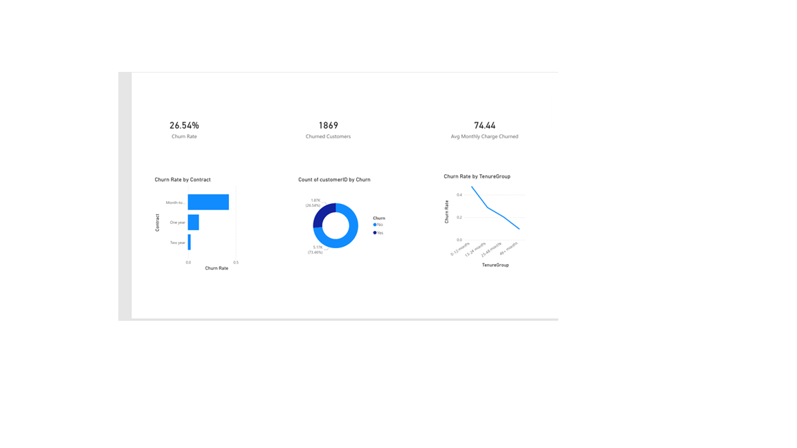

# Customer Churn Analysis

## Project Overview

This project analyzes telecom customer churn using SQL, Python, and Power BI to identify patterns and reduce customer attrition.

---

## Tech Stack

* SQL (MySQL)
* Python (Pandas, Matplotlib, Seaborn)
* Power BI
* Excel

---

## Key Insights

* Month-to-month contracts show highest churn (~42%)
* Customers in first 12 months have highest churn (~47%)
* Automatic payment methods reduce churn risk

---

## Dashboard Features

* KPI Cards (Churn Rate, Customers, Revenue)
* Churn by Contract Type
* Churn Trend by Tenure
* Interactive filtering

---

## Project Structure

data/ → dataset
notebooks/ → Python analysis
sql/ → SQL queries
visuals/ → dashboard files

---

## Business Impact

* Helps identify high-risk customers
* Supports retention strategy decisions
* Improves revenue stability

---

## Author

jagannath iyer

